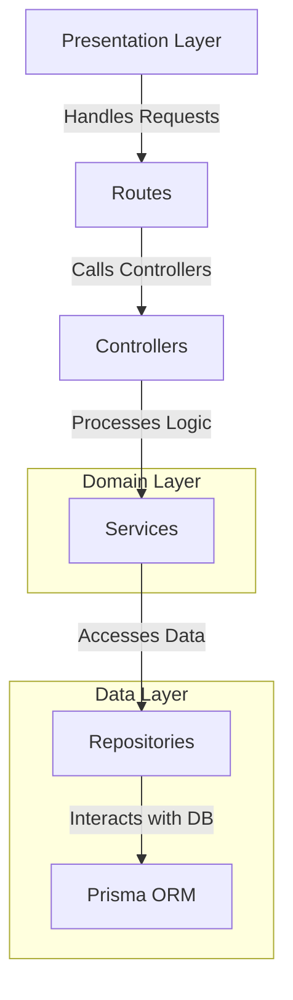
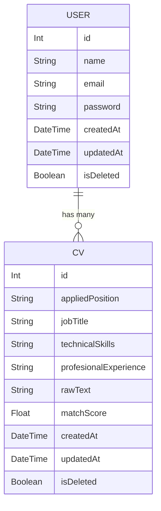

# Note App Backend

This is the backend for a note-taking application built with Express.js.

This project follows a clean architecture approach, which aims to separate concerns and create a maintainable and scalable codebase. Here's a brief explanation of the structure:

## Architecture:


### 📁 Project Structure  

This project follows a clean and organized structure, ensuring maintainability and scalability. Below is an overview of the main directories and files:  

### 📂 Root Directories  
- **`api/`** - Entry point for the API, responsible for initializing and configuring the server.  
- **`prisma/`** - Contains database schema and migration files.  
- **`public/`** - Serves static files used by the application.  
  - **`swagger-ui/`** - Assets for API documentation using Swagger UI.  
- **`src/`** - Main source code directory.  

### 📂 Source Code (`src/`)  
#### 🏗️ Architecture Layers  
- **`controllers/`** - Handles HTTP requests and responses.  
- **`routes/`** - Defines API endpoints and connects them to controllers.  
- **`services/`** - Contains business logic and core application functionality.  
- **`repositories/`** - Manages database operations and interactions.  
- **`models/`** - Defines data structures and database models.  

#### 🔧 Supporting Modules  
- **`middleware/`** - Custom middleware functions for request handling.  
- **`utils/`** - Utility functions to support the application.  
- **`types/`** - TypeScript type definitions for better type safety.  
- **`docs/`** - OPEN API documentation.

## 🛠️ Configuration Files  
- **`package.json`** - Project manifest file.
- **`tsconfig.json`** - TypeScript configuration file.  
- **`vercel.json`** - Configuration for deployment on Vercel.  

## API Endpoints

### Authentication

- `POST /api/auth/sign-up` - Register a new user
- `POST /api/auth/sign-in` - Log in an existing user
- `GET /api/auth/authorize` - Authorize a user session

### Notes

- `GET /api/cvs` - Retrieve all cvs
- `POST /api/cv` - Create a new cv
- `GET /api/cv/:id` - Retrieve a specific cv by ID
- `PUT /api/cv/:id` - Update a specific cv by ID
- `PATCH /api/cv/:id` - Soft delete a specific cv by ID

## Getting Started

### Prerequisites

- Node.js
- npm

### Installation

1. Clone the repository:

```sh
git clone https://github.com/tian0813/be-dicoding-cv.git
```

2. Navigate to the project directory:

```sh
cd be-dicoding-cv
```

3. Install dependencies:

```sh
npm install
```

### Database Setup

#### ERD



1. Migrate prisma database:

```sh
npx prisma migrate dev
```

### Running the Server

1. Start the development server:

```sh
npm start
```

## Contributing

Contributions are welcome! Please open an issue or submit a pull request.

## License

This project is licensed under the MIT License.
